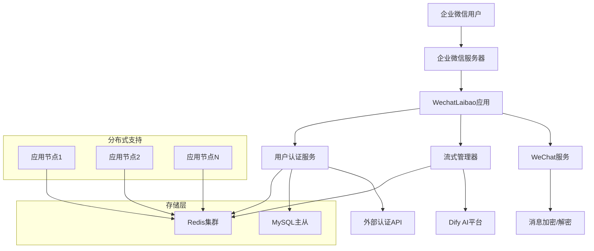
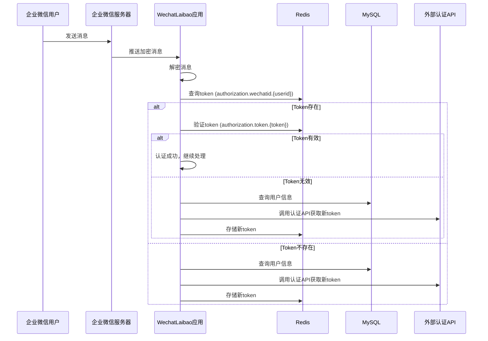
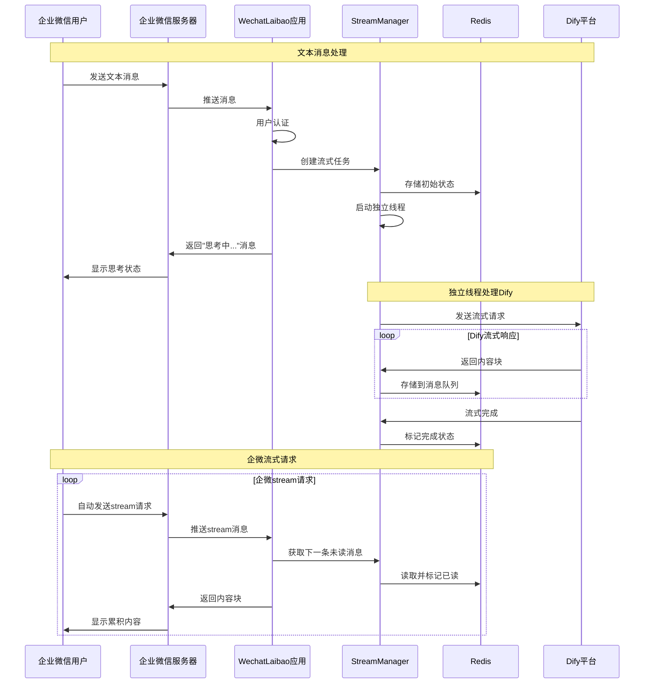
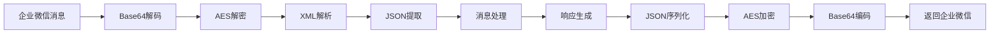

# 企业微信 Dify AI 助手 (WechatLaibao)

一个基于企业微信机器人和Dify平台的智能AI助手，支持流式对话、用户认证和分布式部署。

## 🌟 项目概述

本项目实现了企业微信机器人与Dify AI平台的深度集成，提供完整的用户认证流程和真正的流式对话体验。系统采用分布式架构设计，支持高并发和负载均衡部署。
因为本项目是加入了作者一些三方系统的验证，和dify的api验证改造，所有直接使用会有问题，大家可以借鉴我的代码，删除一些不需要的功能，就可以了。

## 🏗️ 技术架构

### 核心技术栈

- **Web框架**: Flask 2.3.3
- **缓存存储**: Redis 5.0.1  
- **数据库**: MySQL (用户认证)
- **加密组件**: PyCryptodome 3.19.0
- **HTTP客户端**: Requests 2.31.0
- **异步处理**: Python Threading

### 系统架构图



## 🔄 技术流程

### 1. 用户认证流程



### 2. 流式对话处理流程



### 3. 消息加密/解密流程



## 📁 项目结构

```
WechatLaibao/
├── app.py                          # Flask主应用
├── config/
│   ├── __init__.py
│   └── settings.py                 # 配置文件
├── services/
│   ├── __init__.py
│   ├── auth_service.py             # 用户认证服务
│   ├── dify_service.py             # Dify平台接口
│   ├── stream_manager.py           # 流式响应管理器
│   └── wechat_service.py           # 企业微信服务
├── utils/
│   ├── __init__.py
│   └── stream_utils.py             # 流式消息工具
├── demo/
│   ├── WXBizJsonMsgCrypt.py        # 企业微信加密组件
│   └── ierror.py                   # 错误码定义
├── requirements.txt                # 项目依赖
└── README.md                       # 项目文档
```

## 🚀 核心特性

### 1. 分布式架构支持
- **无状态设计**: 所有状态存储在Redis中
- **负载均衡**: 支持多节点部署和负载均衡
- **水平扩展**: 可根据负载动态增减节点
- **故障恢复**: 单节点故障不影响整体服务

### 2. 智能用户认证
- **多级缓存**: Redis token缓存 + MySQL用户数据
- **自动续期**: Token失效时自动重新认证
- **安全机制**: 支持用户code+密码认证
- **状态管理**: 完整的认证状态跟踪

### 3. 真正的流式对话
- **异步处理**: 独立线程处理Dify响应
- **消息队列**: Redis存储分段消息队列
- **逐步显示**: 企微逐条获取并累积显示
- **状态同步**: 跨节点的流式状态同步

### 4. 企业级安全
- **消息加密**: AES加密保护消息内容
- **签名验证**: 验证消息来源合法性
- **重复检测**: 防止重复请求处理
- **异常处理**: 完善的错误处理和恢复

## ⚙️ 配置说明

### Redis配置
```python
REDIS_HOST = '**********'
REDIS_PORT = 6379
REDIS_PASSWORD = '**********'
REDIS_DB = 1
```

### MySQL配置
```python
MYSQL_HOST = '**********'
MYSQL_PORT = 3306
MYSQL_USER = '**********'
MYSQL_PASSWORD = '**********'
MYSQL_DATABASE = '**********'
```

### Dify平台配置
```python
DIFY_BASE_URL = 'http://**********'
DIFY_CHAT_ENDPOINT = '/v1/chat-messages'
DIFY_AUTH_PREFIX = 'Bearer'
```

### 外部认证服务
```python
AUTH_SERVICE_URL = 'http://***************************************'
```

## 🔄 数据流转

### 1. Redis数据结构

**用户Token缓存**:
```
Key: authorization:wechatid:{from_user}
Value: {token}
TTL: 根据业务需求设置
```

**Token验证缓存**:
```
Key: authorization:token:{token}
Value: {user_info}
TTL: 根据业务需求设置
```

**流式任务数据**:
```
Key: dify_stream:{stream_id}
Value: {
  "content": "用户问题",
  "token": "用户token", 
  "user_info": {...},
  "status": "processing|completed|error",
  "conversation_id": "dify对话ID",
  "messages": [
    {
      "content": "响应内容块",
      "read": false,
      "timestamp": "2025-01-15T10:30:00",
      "is_error": false,
      "is_final": false
    }
  ],
  "dify_finished": true
}
TTL: 1800秒 (30分钟)
```


## 🌐 部署方案

### 1. 单机部署
```bash
# 安装依赖
pip install -r requirements.txt

# 配置环境变量
copy demo.env .env

# 启动应用
python app.py
```

### 2. Docker部署
```dockerfile
FROM python:3.9-slim

WORKDIR /app
COPY requirements.txt .
RUN pip install -r requirements.txt

COPY . .
EXPOSE 5000

CMD ["python", "app.py"]
```

### 3. Kubernetes部署
```yaml
apiVersion: apps/v1
kind: Deployment
metadata:
  name: wechatlaibao
spec:
  replicas: 3
  selector:
    matchLabels:
      app: wechatlaibao
  template:
    metadata:
      labels:
        app: wechatlaibao
    spec:
      containers:
      - name: wechatlaibao
        image: wechatlaibao:latest
        ports:
        - containerPort: 5000
        env:
        - name: REDIS_HOST
          value: "redis-service"
        - name: MYSQL_HOST
          value: "mysql-service"
```

## 🔍 监控和调试

### 日志格式
```
[调试] Dify返回内容块 (长度: 245): 您好，**！关于您提到的密码过期问题...
[调试] 累计内容长度: 1024, 消息队列长度: 3
[调试] 读取未读消息 - stream_id: uuid-1234
[调试] 消息索引: 1, 内容长度: 156
[调试] 剩余未读消息数: 2
```

### 性能指标
- **响应时间**: 平均 < 200ms
- **并发支持**: > 1000 QPS
- **内存使用**: < 512MB per node
- **Redis连接**: 连接池复用

## 🚧 故障排查

### 常见问题

1. **Redis连接失败**
   - 检查Redis服务状态
   - 验证网络连接和防火墙
   - 确认密码和端口配置

2. **MySQL认证失败**
   - 检查数据库连接参数
   - 验证用户权限和表结构
   - 确认SQL查询语句正确性

3. **Dify响应超时**
   - 检查Dify服务可用性
   - 验证网络连接和DNS解析
   - 调整请求超时时间

4. **企微消息解密失败**
   - 检查企微应用配置
   - 验证Token和EncodingAESKey
   - 确认消息格式正确性

## 📈 性能优化

### 1. Redis优化
- 使用连接池减少连接开销
- 合理设置TTL避免内存泄漏
- 批量操作减少网络请求

### 2. 应用优化
- 异步处理Dify请求
- 线程池管理并发任务
- 缓存用户认证信息

### 3. 网络优化
- 启用HTTP keep-alive
- 压缩响应数据
- CDN加速静态资源

## 🤝 贡献指南

1. Fork项目仓库
2. 创建功能分支: `git checkout -b feature/new-feature`
3. 提交更改: `git commit -am 'Add new feature'`
4. 推送分支: `git push origin feature/new-feature`  
5. 提交Pull Request

## 📄 许可证

本项目采用 MIT 许可证 - 查看 [LICENSE](LICENSE) 文件了解详情。

## 🆘 技术支持

如遇问题，请通过以下方式联系：

- 创建 [Issue](../../issues)
- 发送邮件至技术支持
- 查看 [Wiki](../../wiki) 获取更多文档

---

**注意**: 本项目仅供学习和研究使用，生产环境部署请确保符合相关法律法规和企业安全规范。